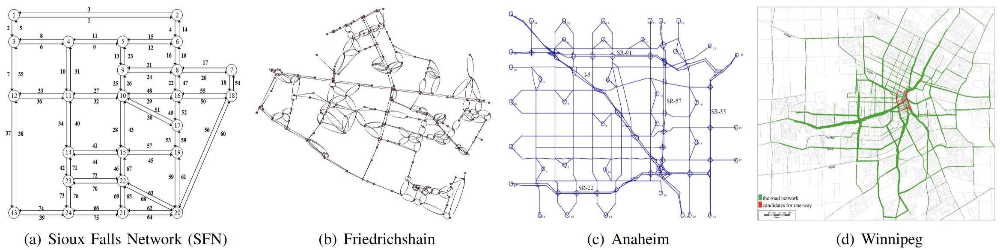
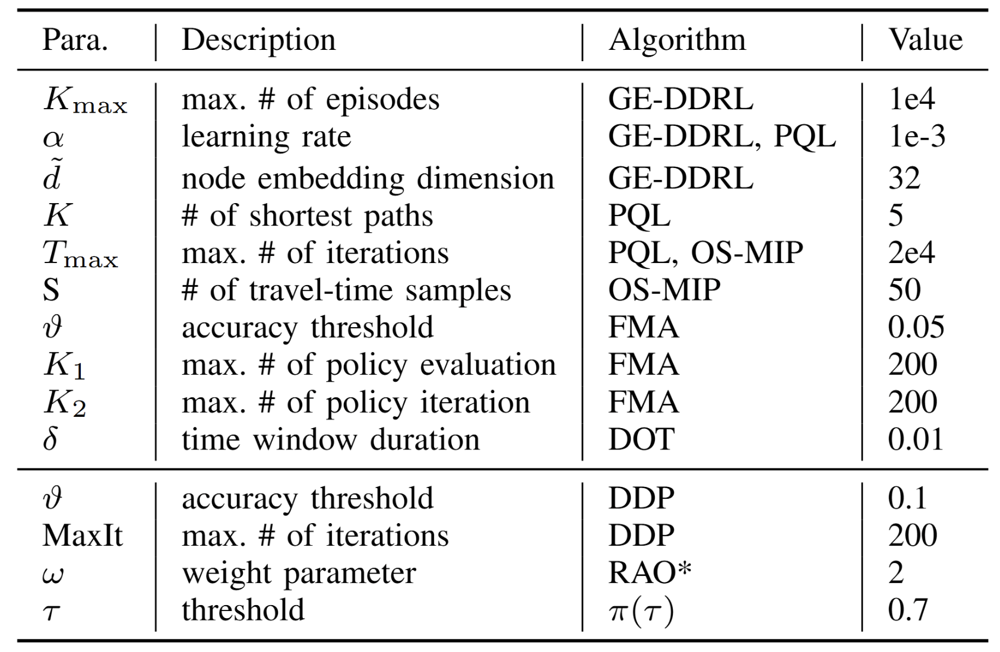

# MARVEL
## Introduction
* This is the code repository for the paper "Multi-Robot Reliable Navigation in Uncertain Topological Environments with Graph Attention Networks" that was submitted to RA-L 2024. The demo video is also uploaded `MARVEL_Demo.mp4`. 
* This is a joint research program of A*STAR and NUS. (© 2024 A\*STAR. All rights reserved.)
## Dataset
Benchmark experiments are conducted on a series of canonical transportation networks, namely Sioux Falls Network, Friedrichshain, Anaheim, and Winnipeg. 

Before you try to run the codes, please download the dataset from this link: https://drive.google.com/file/d/12L7PRDGWPF-S6sz-tFMFgfeBZWwQwVaV/view. Then put them into the folder `Networks` .
## MARVEL Algorithm
### Dependencies 
* Python 3.8
* pandas
* random
* gensim
* NetworkX
* Numpy
* Matplotlib
* PyTorch
* PyTorch Geometric (PyG)
* wandb (optional)
### Description
* We integrate our simulation for MARVEL into the training and test processing. 
* `Embedding.py`:Implements the graph embedding process to generate node features for the robot navigation environment.
* `Env.py`:Constructs the environment, including robot operation and observation processes, defining different topological graph structures
* `GAT.py`: Implements the policy network based on Graph Attention Networks (GAT), integrating success rate changes during training to enhance adaptability and decision-making capabilities in different environments.
* `main.py`: Manages the training process, including all parameter settings such as the map used, training iterations, and optimizer configurations.
* `Test.py`: Tests the final trained MARVEL model and calculates the overall success rate for evaluation.
### Usage
```bash
cd MARVEL
# training. you can config the parameters in main.py
python main.py
# testing.  use your own model by -m /path/to/your/model.pth .
python Test.py
```
## Baseline Algorithms for Benchmark
### Dependencies 
* python 3.7+
* pandas
* random
* SciPy
* NetworkX 2.8.4
* Numpy
* Matplotlib
* Gurobipy (a license might be needed)
### Description
The parameters of our configuration are shown in the table.

`Benchmark_SOTA`:Five benchmark algorithms OSMIP,DOT,FMA,PQL,DDRL
* `yang.py` corresponds to the OSMIP algorithm
* `prakash.py` corresponds to the DOT algorithm
* `fma.py` corresponds to the FMA algorithm
* `PQL.py` corresponds to the PQL algorithm
* `experiment_benchmark`: Includes experiments of GP3, PQL, CTD, and AC
* `experiment_benchmark2`: Includes experiments of FMA, DOT, OS-MIP, and ILP

`Benchmark_CTP`:Three benchmark algorithms DDP, $\pi$($\tau$), RAO*
* `DDP_DL.py` corresponds to the Dual Dynamic Programming algorithm
* `pi_tau.py` corresponds to the $\pi$($\tau$) algorithm
* `RAO_Star.py` corresponds to the RAO* algorithm
All the results of path will be saved in the folder `Networks/{map_name}/Benchmark_Record`
### Usage
```bash
# For SOTA
cd Benchmark_SOTA
python experiment_benchmark.py
python experiment_benchmark2.py
# For CTP
cd Benchmark_CTP
python DDP_DL.py
python pi_tau.py
python RAO_Star.py
# To calculate the success rate
cd Benchmark_Calculate
python calculate_prob.py
```


